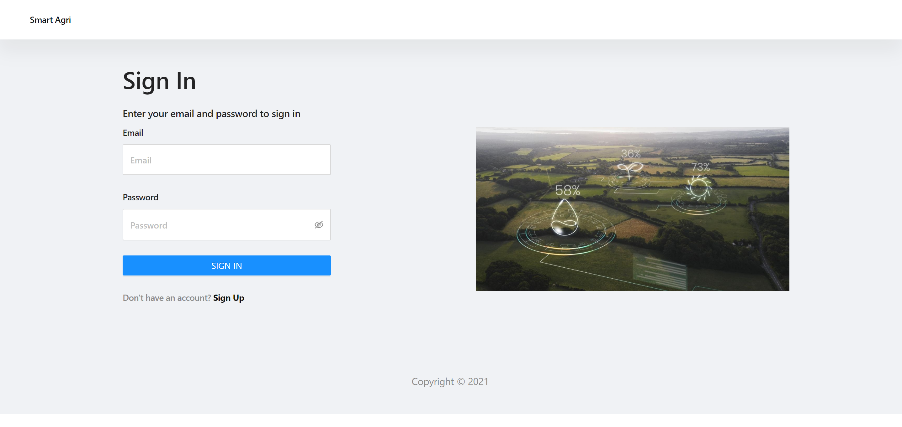
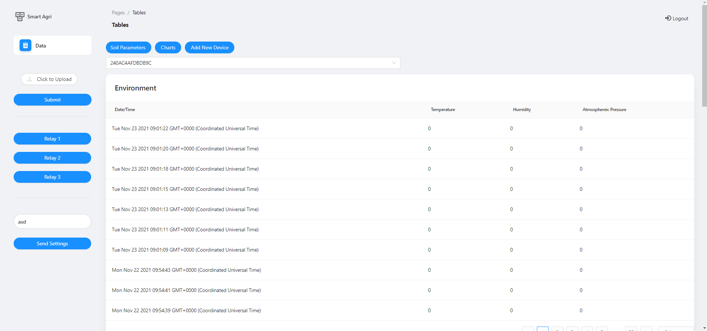

<p align="center">
  <a href="" rel="noopener">
 </a>
</p>

<h3 align="center">SmartAgri</h3>

<div align="center">

[]()

</div>

---

<p align="center"> SmartAgri
    <br> 
</p>

## 📝 Table of Contents

- [About](#about)
- [Getting Started](#getting_started)
- [Circuit](#circuit)
- [Server Details](#server)
- [MQTT Topic Details](#mqtt)
- [API Details](#api)
- [Usage](#usage)
- [List Of Components](#list)
- [Built Using](#built_using)
- [Authors](#authors)

## 🧐 About <a name = "about"></a>

This repo contains

- Backend
- Firmware
- Client auto-Installer script
- Detailed instructions

for Smart SmartAgri.

## Getting Started <a name = "getting_started"></a>

These instructions will get you a copy of the project up and running on your system.

### Prerequisites

Things you need to install the FW.

```
- Arduino IDE
```

### Installing <a name = "installing"></a>

A step by step series that tell you how to get the Firmware and Backend running

#### ESP32 Configuration

You should have Arduino IDE Installed

1.  Add ESP32 Board to your Arduino IDE
1.  In your Arduino IDE, go to File> Preferences
    Installing ESP32 Add-on in Arduino IDE Windows, Mac OS X, Linux open preferences
1.  Enter `https://dl.espressif.com/dl/package_esp32_index.json`
    into the “Additional Board Manager URLs” field then, click the “OK” button:
    Note: if you already have the ESP32 boards URL, you can separate the URLs with a comma(each board will go to neaw line) as follows:
    `https://dl.espressif.com/dl/package_esp32_index.json,\n http://arduino.esp8266.com/stable/package_esp8266com_index.json`

1.  Open the Boards Manager. Go to Tools > Board > Boards Manager…
1.  Search for ESP32 and press install button for the ESP32 by Espressif Systems“:
1.  That’s it. It should be installed after a few seconds.
1.  In your Arduino sketchbook directory, create tools directory if it doesn't exist yet.
1.  Unpack the tool into tools directory(present in libs/ESP32FS-1.0.zip) (the path will look like <home_dir>/Arduino/tools/ESP32FS/tool/esp32fs.jar).
1.  Close and re-open the Arduino IDE.

1.  Now copy the contents of the libs folder to the libraries directory of your Arduino
    1. If you are using windows, the libraries directory will be Documents/Arduino/libraries

##### ESP32 Node FW Uploading

1.  Select ESP32 Dev Module from Tools->Board->ESP32
2.  Select the correct port from Tools->Port
3.  Then open Firmware.ino file,
4.  Select Tools > ESP32 Sketch Data Upload menu item. This should start uploading the files into ESP32 flash file system.
5.  Now Upload the Code to your ESP32 Dev Module.
6.  Your ESP32 is now ready to be used.

## Circuit <a name = "circuit"></a>

### ESP32 Dev Module Pinout

Follow the pinout diagram given below to connect different components to your ESP32 Dev Module board.


### Complete Circuit Diagram

Here's the complete circuit diagram of the system.


## Server Details <a name = "server"></a>
### Monitoring

- CapRover

### List of Packages installed on server

- Mosquitto Broker
- NodeJS, NPM, Node, NVM
- PM2
- ufw
- Caprover
- Docker
- mongod
- mongo-express

### Version Details

- Node v12.16.1
- NPM v6.13.4

### Installation of CapRover

#### Pre Reqs
-   You will need to have a domain name in order to use Caprover.
-   Ubuntu 20.04/18.04 VPS with atleast 2GB RAM and 100GB Disk Space.
-   A public IP for VPS.

####  Installation

-   Open the server terminal and execute the following commands
-   ```sudo apt install ufw```
-   ```sudo ufw allow 22```
-   ```sudo ufw allow 1883```
-   ```ufw allow 80,443,3000,996,7946,4789,2377/tcp; ufw allow 7946,4789,2377/udp;```
-   ```sudo ufw enable```
-   ```sudo apt install apt-transport-https ca-certificates curl software-properties-common```
-   ```curl -fsSL https://download.docker.com/linux/ubuntu/gpg | sudo apt-key add -```
-   ```sudo add-apt-repository "deb [arch=amd64] https://download.docker.com/linux/ubuntu focal stable"```
-   ```apt-cache policy docker-ce```
-   ```sudo apt install docker-ce```
-   ```sudo systemctl status docker```
-   The above command will show the status of Dokcer
-   ```sudo usermod -aG docker ${USER}```
-   ```su - ${USER}```
-   ```groups```
-   The above command should show something like *ubuntu sudo docker*
-   ```sudo reboot```
-   Once the server is rebooted run the following commands

##### Step 1
-   ```docker run -p 80:80 -p 443:443 -p 3000:3000 -v /var/run/docker.sock:/var/run/docker.sock -v /captain:/captain caprover/caprover```

You will see a bunch of outputs on your screen. Once the CapRover is initialized, you can visit http://[IP_OF_YOUR_SERVER]:3000 in your browser and login to CapRover using the default password captain42. You can change your password later. However, do not make any changes in the dashboard. We'll use the command line tool to setup the server.
##### Step 2

Let's say you own mydomain.com. You can set *.something.mydomain.com as an A-record in your DNS settings to point to the IP address of the server where you installed CapRover. Note that it can take several hours for this change to take into effect. It will show up like this in your DNS configs:

TYPE: A record
HOST: *.something
POINTS TO: (IP Address of your server)
TTL: (doesn't really matter)
To confirm, go to https://mxtoolbox.com/DNSLookup.aspx and enter randomthing123.something.mydomain.com and check if IP address resolves to the IP you set in your DNS. Note that randomthing123 is needed because you set a wildcard entry in your DNS by setting *.something as your host, not something.

##### Step 3
Assuming you have npm installed on your local machine (e.g., your laptop), simply run (add sudo if needed):

-   ``` sudo npm install -g caprover```
  
Then, run

- ```caprover serversetup```


Follow the steps and login to your CapRover instance. When prompted to enter the root domain, enter something.mydomain.com assuming that you set *.something.mydomain.com to point to your IP address in step #2. Now you can access your CapRover from captain.something.mydomain.com

Note: It will not be possible to carry through with the 'caprover serversetup' if you've already forced https on your CapRover instance.
In such case go straight to logging in with the caprover login command. To change the password go to the settings menu in the app.

#### Deployment

-   Once the CapRover is running, open the dashboard and create 2 new apps named
1.  smart-agri-backend
2.  smart-agri-frontend

Then create go to one click apps and search MongoDB and install it with the following settings

-   Name: smart-agri-database
-   MONGO_INITDB_ROOT_USERNAME: smartAgriDatabase
-   MONGO_INITDB_ROOT_PASSWORD: sma$r$t$Agr$iD$a$%tabase

Once done, go to Web App folder
-   Open frontend root, compress everything as .tar using 7zip or tar if using terminal
-   Open backend folder and again compress everything as .tar
-   Then in caprover open smart-agri-backend->Deployment->Upload & Deploy your .tar file, do the same for front-end as well.

### Server Links <a name = "srv"></a>

- MQTT Broker Link: hivemq.com
- Backend Link: http://smart-agri-backend.iot.intelligadgets.me/
- Frontend Link: https://smart-agri-frontend.iot.intelligadgets.me/

### Backend

- Backend is based on NodeJS and it is being managed by Caprover. It starts automatically on server start.

## MQTT Topic Details <a name = "mqtt"></a>


### Topics List

#### Logs

1.  <span style="color: green">smart-agri/logs</span> `(all log messages are published to this topic) READ-ONLY`

#### Fimrware

1.  <span style="color: green">smart-agri/deviceExists</span> `(Publish DeviceMAC on this topic to check if device exisits in DB) WRITE-ONLY`
    1.  <span style="color: green">smart-agri/deviceExistance</span> `(Response from the above command {null or device MAC}) READ-ONLY`

2.  <span style="color: green">data/MAC_ADDRESS</span> `(Publish data to update a device in DB based on its MAC Address.) WRITE-ONLY`
    - Data Format: 
        ```JSON
        {
        "_id":"616fb42d27d2b5351d8a013e",
        "macAddress":"240AC4AFDBDB9C",
        "FW_Version":"v1.0",
        "Environment":
        [
            {
                "Temperautre":12.1,
                "Humidity":54,
                "Atmospheric_Pressure":37.78,
                "_id":"616fb42d27d2b5351d8a013f"
            }
        ],
        "Soil_Parameters":
        [
            {
                "Soil_Moisture":5.44,
                "EC":87.52,
                "pH":47.31,
                "Nitrogen":54.64,
                "Phosphorus":97.13,
                "Potassium":51.03,
                "_id":"616fb42d27d2b5351d8a0140"
            }
        ],
        "createdAt":"2021-10-20T06:16:13.901Z",
        "updatedAt":"2021-10-20T06:16:13.901Z",
        "__v":0
        }
        ```

## API Details <a name = "api"></a>

### Live Sensor Nodes

```http
POST http://smart-agri-backend.iot.intelligadgets.me/api/mqtt
```

| Parameter | Type      | Description |
| :-------- | :-------- | :---------- |
| `nothing` | `nothing` | nothing     |

-   Returns the list of live sensor nodes

### Users Register


```http
POST http://smart-agri-backend.iot.intelligadgets.me/api/users/register
```

| Parameter  | Type            | Description                              |
| :--------- | :-------------- | :--------------------------------------- |
| `email`    | `email address` | **required** enter a valid email address |
| `password` | `password`      | **required** enter a password            |

-   User registration


### Users Register


```http
POST http://smart-agri-backend.iot.intelligadgets.me/api/users/login
```

| Parameter  | Type            | Description                              |
| :--------- | :-------------- | :--------------------------------------- |
| `email`    | `email address` | **required** enter a valid email address |
| `password` | `password`      | **required** enter a password            |

-   User login

### Responses


Many API endpoints return the JSON representation of the resources created or edited. However, if an invalid request is submitted, or some other error occurs, Gophish returns a JSON response in the following format:

```javascript
{
  "status"  : int,
  "message" : string
}
```

The `message` attribute contains a message commonly used to indicate errors or to return the logged status/

The `status` attribute describes if the transaction was successful or not.

### Status Codes

SmartAgri Backend returns the following status codes in its API:

| Status Code | Description             |
| :---------- | :---------------------- |
| 200         | `OK`                    |
| 201         | `CREATED`               |
| 400         | `BAD REQUEST`           |
| 404         | `NOT FOUND`             |
| 500         | `INTERNAL SERVER ERROR` |

## Usage <a name = "usage"></a>

1.  Upload the code to your ESP32.
2.  Open the dashboard to monitor the parameters.
    1.  Dashboard Default credentials
        1.  Email Address: **admin@admin.com**
        2.  Password: **admin**

Dashboard Login Page
Dashboard Signup Page
Dashboard Home Page
png) 
4. Power on your ESP32, it will present you with an AP named `SmartA-abc` (while `SmartA` can be changed in the portal and `abc` is a unique id for each esp32)
5. Default captive portal password `12345678AP` which can be changed in captive portal. 
6. Connect to the ESP32 access point and open the web-browser and navigate to the link `http://esp32.local/_ac`. This link will work on most of the operating systems but if your operating system is not allowing to open it, you may want to check the captive portal IP Address from the serial monitor and can use that IP address inplace of the above mentioned URL. 
7. The default access IP Address is `http://192.168.4.1/_ac` 8. You will be presented with a main dashboard as shown below(based on your device)


8.  Once connected to a WiFi network, you can again access the captive portal using same URL or the IP Address from the Serial monitor.
9.  The data is published to the MQTT Topic `SmartA/{hostname}` while the hostname is the one which you can define in Settings page of the captive portal.
10.  You can open settings page with following default credentials
     1.  User: **AP Name (SmartA)**
     2.  Password: **admin**

## List of Components <a name = "list"></a>

Following components are used to make this project

1.  ESP32 Dev Module
    ○ https://www.amazon.com/ESP32-WROOM-32-Development-ESP-32S-Bluetooth-Arduino/dp/B084KWNMM4/ref=sr_1_10?dchild=1&keywords=esp32+dev+module&qid=1631286335&sr=8-10
2.  Atmospheric Temperature and Humidity Sensor (BME280)
    ○ https://www.amazon.com/HiLetgo-Temperature-Humidity-Electronic-Practice/dp/B0795F19W6/ref=sr_1_2?dchild=1&keywords=dht22&qid=1631286498&sr=8-2
3.  Capacitive Soil Moisture Sensor
    ○ https://www.amazon.com/Icstation-Resistive-Soil-Moisture-Sensor/dp/B076DDWDJK/ref=sr_1_7?dchild=1&keywords=soil+moisture+sensor&qid=1631286644&sr=8-7
4.  NPK Sensor
    ○ https://www.amazon.com/Neufday-Precision-Nutrient-Intelligent-Fertilizer/dp/B0836WYNJ1/ref=sr_1_2?dchild=1&keywords=soil+npk+sensor&qid=1631286692&sr=8-2
5.  TTL to RS485 Converter
    ○ https://www.amazon.com/HiLetgo-Reciprocal-Hardware-Automatic-Converter/dp/B082Y19KV9/ref=sr_1_2?crid=1GFISE1RJQ65Z&dchild=1&keywords=ttl+to+rs485+converter&qid=1632822148&sprefix=ttl+to+rs485+co%2Caps%2C728&sr=8-2
6.  Soil pH Sensor
    ○ https://www.amazon.com/Taidacent-Detector-Agricultural-Phosphorus-Potassium/dp/B08MXVSKG9/ref=sr_1_1?dchild=1&keywords=soil%2Bph%2Bsensor&qid=1631286952&sr=8-1&th=1
7.  Soil EC Sensor
    ○ https://www.amazon.com/Taidacent-Detector-Agricultural-Phosphorus-Potassium/dp/B08MXVSKG9/ref=sr_1_1?dchild=1&keywords=soil%2Bph%2Bsensor&qid=1631286952&sr=8-1&th=1
8.  9V 5A Adapter
    ○ https://www.amazon.com/Supply-Adapter-Converter-Regulator-Monitor/dp/B0888DQ343/ref=sr_1_4?dchild=1&keywords=9v+5a+dc+adapter&qid=1631287139&sr=8-4
9.  9V to 5V Buck Converter
    ○ https://www.amazon.com/UCTRONICS-Converter-Transformer-Voltage-Regulator/dp/B07XXWQ49N/ref=sr_1_1?dchild=1&keywords=9v+to+5v+step+down+converter&qid=1631287177&sr=8-1

## ⛏️ Built Using <a name = "built_using"></a>

- [NodeJS](https://nodejs.org/en/) - JS Framework for Backend Programming
- [Eclipse Paho MQTT](https://www.eclipse.org/paho/index.php?page=clients/python/index.php) - MQTT Client for Backend and RPiClient Software
- [Arduino](https://www.arduino.cc/) - Embedded Framework and IDE - For Sensor Node Design
- [VueJS](https://vuejs.org/) - For Dashboard Design

## ✍️ Authors <a name = "authors"></a>

- [@Nauman3S](https://github.com/Nauman3S) - Development and Deployment
